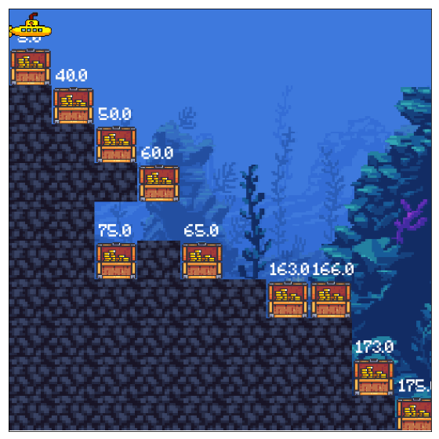

# `Deep Q-Managed: A New Framework For Multi-Objective Deep Reinforcement Learning` 

### Graduate Program in Electrical and Computer Engineering

#### Department of Computer Engineering and Automation 


## Abstract

The Deep Q-Managed algorithm, introduced in this paper, constitutes a notable improvement in the domain of multi-objective reinforcement learning (MORL). This new approach employs an enhanced methodology for multi-objective optimization, which strives to discover all policies within the Pareto Front. This demonstrates remarkable proficiency in attaining non-dominated multi-objective policies across environments characterized by deterministic transition functions. Its adaptability extends to scenarios featuring convex, concave, or mixed geometric complexities within the Pareto Front, thus rendering it a versatile solution suitable for addressing a diverse range of real-world challenges. To validate our proposal, we conducted extensive experiments using traditional MORL benchmarks and varied configurations of the Pareto front. The effectiveness of the policies generated by our algorithm was evaluated against prominent approaches in the literature using the hypervolume metric. The results obtained from these experiments unequivocally establish the Deep Q-Managed algorithm as a contender for addressing complex multi-objective problems. Its ability to consistently produce high-quality policies across a spectrum of environments underscores its potential for practical applications in numerous domains, ranging from robotics and finance to healthcare and logistics. Furthermore, the algorithm's robustness and scalability make it well-suited for tackling increasingly intricate multi-objective optimization tasks, thereby contributing to future advancements in the field of MORL.

## Installation

To run the provided code, the first step is to clone this repository, which can be accomplished by:

```console
user@computer:~$ git clone https://github.com/xarmison/deep_q_managed
```

### Python environment

This section is a guide to the installations of a python environment with the requirements of this repository.

First, install [Anaconda](https://www.anaconda.com/distribution/) or [Miniconda](https://docs.conda.io/en/latest/miniconda.html), both of them give you the "conda" command line tool , but the latter requires less disk space.

Now, create a python virtual environment and install the required packages following the commands. Substitute **<environment_name>** with a name for your environment

Open your terminal and execute the following commands:

```console
user@computer:~$ conda create -n <enviroment_name> anaconda python=3
user@computer:~$ conda activate <enviroment_name> || source activate <enviroment_name>
(<enviroment_name>) user@computer:~$ conda install --yes --file requirements.txt
```

### Customized Environments Library

Next you'll need to install a customized [MO-Gymnasium](https://mo-gymnasium.farama.org/) module that provide the custom reinforcement leaning environments built for the benchmarks presented in the research. 

```console
user@computer: ~/deep_q_managed $ cd MO-Gymnasium
user@computer: ~/deep_q_managed/MO-Gymnasium $ pip install .
```

## Deep Sea Treasure

|   Deep Sea Treasure (DST)   | Bountiful Sea Treasure (BST) | Modified Bountiful Sea Treasure (MBST) |
|:---------------------------:|:----------------------------:|:--------------------------------------:|
|  |   |           |

The customized installation of the Gymnasium includes three modified implementations of the Deep Sea Treasure, which can be accessed using the default instantiation of environments:

- Deep Sea Treasure (DST): `dst_env = mo_gym.make('deep-sea-treasure-v1', render_mode='rgb_array')`
- Bountiful Sea Treasure (BST): `bst_env = mo_gym.make('bountiful-sea-treasure-v1', render_mode='rgb_array')`
- Modified Bountiful Sea Treasure (MBST): `mbst_env = mo_gym.make('modified-bountiful-sea-treasure-v1', render_mode='rgb_array')`

All the necessary implementations for running the proposed Deep Q-Managed algorithm in all Deep Sea Treasure environments can be found in the notebook file [deep_sea_treasure.ipynb](./notebooks/deep_sea_treasure.ipynb). To facilitate navigation and experimentation, the file is divided into the following sections:

- Agent Brain

    This section contains all the code for the agent functions. Implemented through the following classes: 

    - Replay memory

        ```python
        class ReplayBuffer:
            def __init__(self, max_size: int, input_shape: list) -> None:
                ...
            
            def store_transition(self, state: np.array, action: int, reward: float, state_: np.array, done: bool) -> None:
                ...
            
            def sample_buffer(self, batch_size: int) -> tuple:
                ...
        ```

    - Deep Neural Network approximator

        ```python
        class DuelingDeepNetwork(nn.Module):
            def __init__(self, learning_rate: float, n_actions: int, input_dims: list, name: str, chkpt_dir: str) -> None:
                ...

            def forward(self, state: T.Tensor) -> Tuple[T.Tensor, T.Tensor]:
                ...
            
            def save_checkpoint(self) -> None:
                ...

            def save_best(self, final_state: tuple) -> None:
                ...
            
            def load_checkpoint(self) -> None:
                ...
        ```

    - An agent abstraction to facilitate the choosing of an action and the update of the neural network's weights

        ```python
        class Agent:
            def __init__(
                self, gamma: float, epsilon: float, learning_rate: float, n_actions: int, 
                input_dims: list, mem_size: int, batch_size: int, 
                eps_min: float = 0.01 , eps_decay: float = 5e-7, 
                replace: int = 1000, 
                chkpt_dir: str = 'backup'
            ) -> None:
                ...
            
            def choose_action(self, observation: tuple) -> Tuple[np.array, str]:
                ...
            
            def decrement_epsilon(self) -> None:
                ...

            def save_models(self) -> None:
                ...

            def save_best(self, final_state: tuple) -> None:
                ...

            def load_models(self) -> None:
                ...

            def learn(self) -> float:
                ...
        ```

- Helper Functions

    As the title suggests, this section contains several auxiliary functions.

    - Some manager tasks:

        ```python
        def check_for_unblock(
            env: gym.Env, action: int, current_path: list, 
            converged_paths: dict[tuple, list], 
            converged_episodes: dict[tuple, int]
        ) -> tuple[dict, dict]: 
            ...
        ```

        ```python
        def increment_heatmap(heatmap: np.array, episode_path: list[tuple]) -> None:
            ...
        ```

    - And a plotting function to peer into the progress of the agent or to get a summary of the agent trajectory after it converges to all solution states:

        ```python
        def plot_learning(
            scores: list[float], 
            epsilons: list[float], 
            losses: list[float], 
            actions_history: list[dict], 
            heatmap: np.array,
            converged_episodes: dict[tuple, int], 
            env_img: np.array,
            filename: str = None
        ) -> None:
            ...
        ```


- Learning Loop

    This section contains the function that implement the learning loop of the Deep Q-Managed algorithm, which can be applied to any of the three environments.

    ```python
    def learn_env(
        env: gym.Env, agent: Agent, 
        conversion_threshold: int = 300,
        n_trial: int = 1,
        load_checkpoint: bool = False, 
        write_results: bool = False, 
        plots_dir: str = 'plots'
    ) -> tuple:
        ...
    ```
 
The subsequent sections present the code utilized to execute the algorithm in each of the evaluated environments:
- Deep Sea Treasure (DST)
- Bountiful Sea Treasure (BST)
- Modified Bountiful Sea Treasure (MBST)


## Modified Resource Gathering (MRG)

|           391 Treasure          |            441 Treasure          |            616 Treasure          |
|:-------------------------------:|:--------------------------------:|:--------------------------------:|
|  |   |   |

The provided customization of the Gymnasium module also includes a new problem based on the resource gathering task, namely the Modified Resource Gathering, which can be accessed using `mrg_env = mo_gym.make('modified-resource-gathering-v0', render_mode='rgb_array')`.

All the necessary implementations for running the proposed Deep Q-Managed algorithm in all Deep Sea Treasure environments can be found in the notebook file [modified_resource_gathering.ipynb](./notebooks/modified_resource_gathering.ipynb). This notebook follows the same structure discussed previously for the Deep Sea Treasure group of environments.

## Scripts

There are two utility programs in the [script's folder](./scripts/) that allow you to run multiple trials of the algorithm with different threshold values. If the option is enabled, the backup files for the weights of neural networks will be stored in the [backups folder](./scripts/backups/), while the solution files containing the Pareto Front discoveries and the times spent in each run will be stored in the [solutions folder](./scripts/solutions/).

- DST Utility

    This utility will generate a thread for each of the Deep Sea Treasure environments. Each of these threads will execute n_runs for each of the solicited threshold values.

    Usage:

    ```console
    user@computer: ~/deep_q_managed/scripts $ python dst_multiple_trials.py n_runs threshold_1 threshold_2 ... threshold_n
    ```

    Example:

    ```console
    user@computer: ~/deep_q_managed/scripts $ python dst_multiple_trials.py 2 100 150
    Processing 2 runs for each Deep Sea Treasure Env with the following thresholds: [100, 150]
    Processing DST...
    Processing BST...
    Processing MBST...
    .......
    All threads have finished running
    ```

- MRG Utility

    This tool offers a more in-depth view of the learning in the environment, since it runs in a single thread. However, it can be extended to run each trial in a separate thread if the computational resources are available.

    Usage:

    ```console
    user@computer: ~/deep_q_managed/scripts $ python python mrg_multiple_trials.py n_runs threshold_1 threshold_2 ... threshold_n
    ```

    Example:

    ```console
    user@computer: ~/deep_q_managed/scripts $ python python mrg_multiple_trials.py 2 100 150
    Runing 2 trials of learn_env for thresholds [100, 150]
    Episodes since last epsilon reset: 0    Episodes since last valid path: 1

    Episode 0 of 100000
            Score: 233.00   Treasure: 566 (R1-R2-R3-R4)     AVG Score: 233.00       Mean Loss: 129.356238   Epsilon: 0.727000

            Unique valid paths: 0 -> Top 5 repetitions: {}

            Returned home with gold: 0 (0.0%)       Got lost: 1 (100.0%)    Paths with forced actions: 0 (0.0%)     Boosted Paths: 0 (0.0%)
            Latest episode path length: 100 [(0, 1), ..., (3, 2)]

            Actions taken in episode: NN: 9, Rand: 91, Forced: 0

            Converged epsiodes: {}

            Converged solutions: []

            Boosted long path: 0

    Last episode heatmap:
    [[ 0  9 13  7  6]
    [ 1  3  4  4  4]
    [ 2  5  6  2  1]
    [ 3  6  6  2  3]
    [ 3  5  4  1  0]]
    All episodes heatmap:
    [[ 0  9 13  7  6]
    [ 1  3  4  4  4]
    [ 2  5  6  2  1]
    [ 3  6  6  2  3]
    [ 3  5  4  1  0]]
    .......
    Agent converged for all desired solutions
    ```